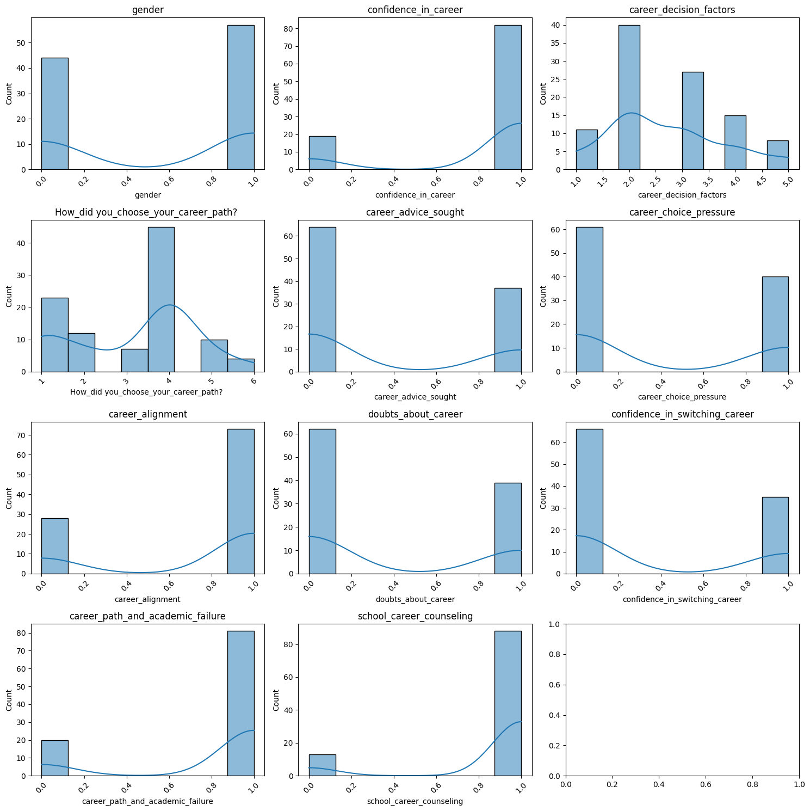
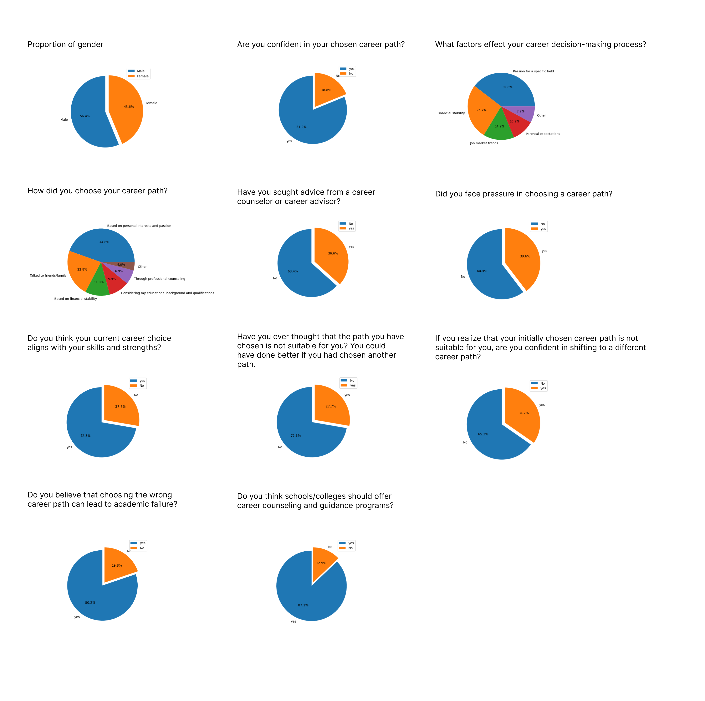
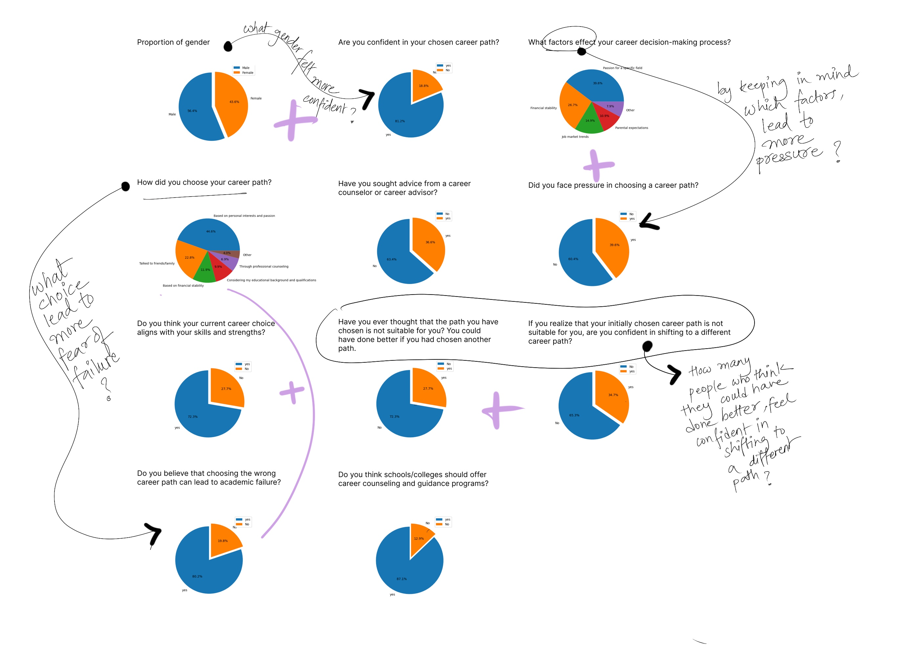
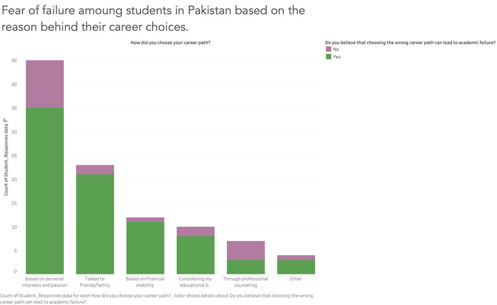
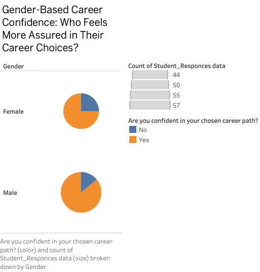

# Assignment 3 & 4: Critique by Design
By Mish Patel

Last semester during my user research project, I carried out a survey and it had a lot of yes/no questions in it. I had a difficult time in how to visually convey a data that didn’t have a lot of numeric data in order to get the point I was trying to make get across. Thus, this time I wanted to challenge myself and try out a data set that had was more on those lines. The below provided data visualizations have been sourced from : https://www.kaggle.com/code/mtalhazafar/student-career-path-and-decision-making-analysis/notebook#Are-you-confident-in-your-chosen-career-path?

The intent of the researcher was to illustrate the intricate relationship between students' career choices and their overall well-being and academic performance. He has created two larger sets of data visualization – one using Python and other I believe Microsoft Excel.

As I critiqued the above two charts using Stephen Few's Data Visualization Effectiveness Profile, the primary thing I realized that it was falling short on a lot of measures due to one major reason – Lack of a story that it wanted to tell. The data was presented in many pieces and these pieces had no meaning. The more I tried to read each graph/chart, the more I thought – So what? Out of the students who took the survey, 43.6% were female and 56.4% were male – but so what? That’s when I realized the need to make connections and draw links. This led to the following exercise where I tried to extract meaning out of the data presented. (Tool used – Procreate)
 

This helped me put the information/data into context where it can provide the reader with various insights. By doing so, I generated the following preliminary graphs (Tool used – Tableau) on the following three new topics – 

-	Fear of failure among students in Pakistan based on the reason behind their career choices. (How did students choose their career paths and what choices made them fear academic failure?)
-	Students feel pressurized in choosing a career path when they focus on what factors in career decision making process?
-	What Gender Feels More Assured in Their Career Choices? 
 
 
 
 
  
Feedback received on the above initial charts from peers – 
-	The first and the second graphs, now that the data is combined from original, do have multiple stories to tell. Which story am I trying to tell? Try to narrow down and focus on one thing – go one level deeper in terms of story building. 
-	For the first two, perhaps, the bar graphs could be placed next to each other to simplify the visual.
-	The second pie chart – though it gives a useful information – is it needed as a visualization? If the information can be communicated through statement in simple manner – why not just use that ? For example, x% of men feel more confident in their career choices in comparison to only y% female. 
-	The legends and labels could be made better. (at this point they were just placeholders).

[Back to Portfolio](https://misarip.github.io/Mish_Portfolio/)
