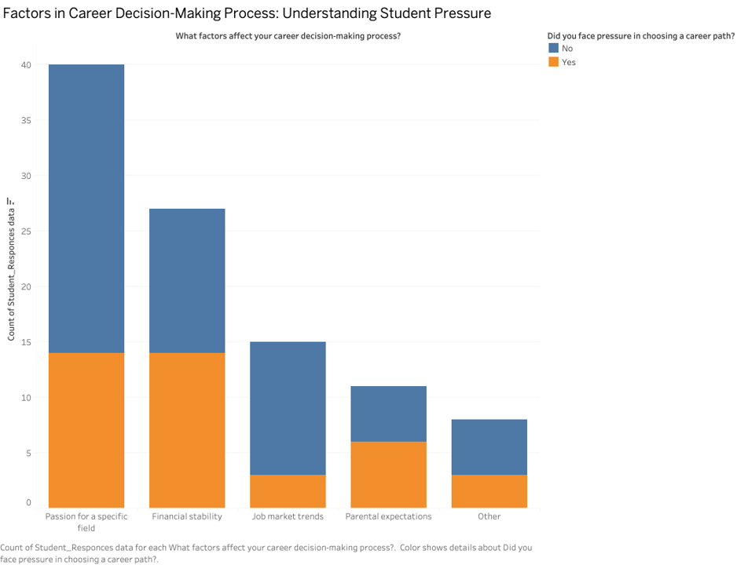

# Assignment 3 & 4: Critique by Design
Mish Patel, Telling Stories with Data

## DATA VISUALIZATION SELECTION

Last semester during my user research project, I carried out a survey and it had a lot of yes/no questions in it. I had a difficult time in how to visually convey a data that didn’t have a lot of numeric data in order to get the point I was trying to make get across. Thus, this time I wanted to challenge myself and try out a data set that had was more on those lines. 
Dataset and visualizations from : https://www.kaggle.com/code/mtalhazafar/student-career-path-and-decision-making-analysis/notebook#Are-you-confident-in-your-chosen-career-path?

The intent of the researcher was to illustrate the intricate relationship between students' career choices and their overall well-being and academic performance. He has created two larger sets of data visualization – one using Python and other I believe Microsoft Excel.

## ANALYZING THE DATA VISUALIZATIONS
I critiqued the above two charts using Stephen Few's Data Visualization Effectiveness Profile

INFORMATIVE MEASURES 
• Usefulness 
The information is very useful however the way it has been presented doesn’t help the reader gain any feedback or insights in a clear manner. The data collected is presented as is in form of visual representations, there are no clear connections between these different pieces of information in order to understand the story behind it. I would try to make links and connections in order to find out these insights and then communicate that.

• Completeness 
There is no overall title provided to the bar charts. If there was a title that said ‘Information on Student’s Career Choices in Pakistan’ it would have been very helpful to set some context. There are individual titles on each chart in the first data visualization, but there is a lack of labels. The reader would not understand what the numeric labels are on the x-axis.  In the second visualization, there are titles but in form of questions the questions are same as the ones used to collect data. 

• Perceptibility
The bar charts are highly confusing as they also have a flow line overlapping them and since there is no context or legend provided, it is hard to understand the meaning behind the flow chart. In the bar charts, the title is places center aligned to all the charts to bring in some focus but there is no hierarchy or emphasis drawn at any points by using different font sizes or bold text in order to increase perceptibility. 

• Truthfulness
The scale of the information seems to be accurate, however it is always hard to tell in pie charts. There is no story built and therefore it is difficult for me to say if the titles or inferences hold any truth to the data represented. 

• Intuitiveness
The forms used – bar and pie charts – both are very familiar and easy to understand in general terms. The way the information is structured in the bar charts as in Yes/no answers are put at two extremes and there are empty slots in between, makes no sense for the reader. If there were any instructions provided on how to read these it would have been helpful.

EMOTIVE MEASURES 

• Aesthetics – The first chart uses single color – blue – which doesn’t help differentiate between the yes/no data let along other data that has multiple answers. However, the second data visualization – pie charts – use a nice contrasting shade of orange and blue which provides clarity in yes/no answers; the multiple answers pie chart appears to be a rainbow and this effect could have been avoided by using different shades of one color. Also, orange and blue are quite a traditional combination – I would choose a little unconventional shade of both to provide freshness. Also, since there are so many pie charts put together one after another, it does feel a little mundane and repetitive to see the same colors again and again. 

• Engagement
There is no distraction from data, but it doesn’t even seem to be of a kind that excites the reader because of the most basic form of representation and lack of some context.  

In all, the primary realization was that it was falling short on a lot of measures due to one major reason – Lack of a story that it wanted to tell. The data was presented in many pieces and these pieces had no meaning. The more I tried to read each graph/chart, the more I thought – So what? Out of the students who took the survey, 43.6% were female and 56.4% were male – but so what? That’s when I realized the need to make connections and draw links. 

## INITIAL REDESIGN - Extract & Convey Meaning

Critiquing led to the exercise where I tried to extract meaning out of the data presented (Sketching Tool used – Procreate).This helped me put the information/data into context where it can provide the reader with various insights. 
 

By doing so, I generated the following preliminary graphs (Tool used – Tableau) on the following three new storylines – 

-	Fear of failure among students in Pakistan based on the reason behind their career choices. (How did students choose their career paths and what choices made them fear academic failure?)
-	Students feel pressurized in choosing a career path when they focus on what factors in career decision making process?
-	What Gender Feels More Assured in Their Career Choices? 

VISUALIZATION 1 : 
 

VISUALIZATION 2 : 
 

VISUALIZATION 3 : 
 
  
## TESTING THE SOLUTION

Approach: 
-	Showed the original data visualizations and explained the creator’s intented meaning and purpose for it.  
-	Presented my thoughts on them and sketches explaining what I was trying to do with my redesigns.
-	Questions that were asked to the peer reviewers - 
  What's the first thought you develop as you look at the graphic? 
  Is the narrative apparent? 
  What do you like/dislike?  
  How is it helping you understand and where is it creating misinformation? 
 
Peer Review Feedback 1:
-	I Like how you are overlapping two charts to create more insightful information. 
-	The first and the second graphs, now that the data is combined from original, have multiple stories to tell. Which story are you trying to tell? Right now, there could be multiple ways to interpret this - people who pursue career mostly fear academic failure or it can also be people who seek professional counseling do not fear academic failure. Highlight one aspect of it.  Try to narrow down and focus on one thing – go one level deeper in terms of story building. 

Peer Review Feedback 2: 
- For the first two, perhaps, the bar graphs could be placed next to each other to simplify the visual.
- The second pie chart – though it gives a useful information – is it needed as a visualization? If the information can be communicated through statement in simple manner – why not just use that? For example, x% of men feel more confident in their career choices in comparison to only y% female. 
- The legends and labels could be made better; they are confusing are right now. What does Count of Student Responses data mean – can we just say Number of students? (at this point they were just placeholders).
- Colors are very overwhelming – do we need these many colors?

Action steps from the feedback received - 
- Find an even more focused story, perhaps, and reflect that in the headline. 
- Simply the use of colors. 
- Question whether a visualization is needed to communicate the information.
- Make sure labels are to the point and clear. 

## BUILDING THE SOLUTION

<iframe title="Report Section" width="900" height="500" src="https://app.powerbi.com/view?r=eyJrIjoiYzRlMWJmYjQtYmQyZS00MGEyLThkYWQtYjA4ODQ3ZWUxZDRjIiwidCI6ImUzNmVlMzhmLTkxYjgtNGRjYS05YjEzLWNhYTUzNjBjOTcxNCIsImMiOjF9" frameborder="0" allowFullScreen="true"></iframe>

<iframe title="Report Section" width="900" height="400" src="https://app.powerbi.com/view?r=eyJrIjoiMTdlYWMzZWEtNjdmMy00YjdiLTg1YTAtMmE3YjI4NGJkNGJmIiwidCI6ImUzNmVlMzhmLTkxYjgtNGRjYS05YjEzLWNhYTUzNjBjOTcxNCIsImMiOjF9" frameborder="0" allowFullScreen="true"></iframe>

[Back to Portfolio](https://misarip.github.io/Mish_Portfolio/)
