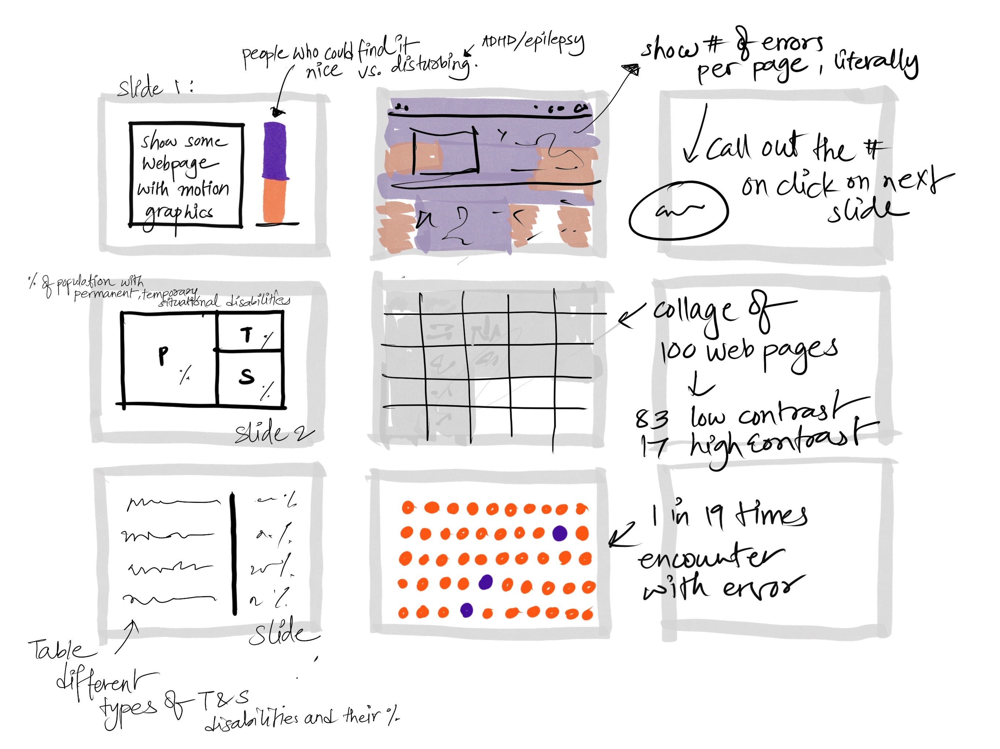

# Final Project: Part I
### Outline

**There is a need to increase Web accessibility and expand product offerings surrounding it.**

### Summary

There are disabilities identified as Temporary and Situational disabilities by Inclusive - Microsoft’s design Toolkit. Color-vision problems in the blue-yellow spectrum affected 45% of people in their mid-70s, and that proportion rose to two-thirds by the time people reached their mid-90s[1]. A study published in the Journal of Cognitive Psychology found that individuals with ADHD had difficulty distinguishing between important and unimportant information on news websites, leading to reduced recall of important information. Around 1 in 100 people have epilepsy and of these people, around 3% have photosensitive epilepsy. Photosensitive epilepsy is more common in children and young people (up to 5%)[2]. There are many other conditions that may affect the way one accesses the internet.

When we look at how designers and developers use modern tools to provide accessible content to their website visitors, there is research done that can tell us that even when WCGA Guidelines are followed, web viewing is not fully accessible. Some interesting findings are - 

* An average of 50 accessibility errors per page were found in an analysis of over 1 million home pages[3].
* 83.9% of home pages had low-contrast text averaging 31 instances per home page[3].
* Users with disabilities would expect to encounter errors on 1 in every 19 home page elements with which they engage[3]

As part of my final project, I want to build data visualizations that inform the audience, web designers, and developers, about the need to increase web accessibility to take into consideration all kinds of disabilities by visually communicating such vital findings. I want them to feel the scale of accessibility incorporated vs. left out and the number of users it impacts. 

**SET UP:** Temporary and Situational Disabilities exist in large amounts.

**CONFLICT:** Current websites/web pages are not fully accessible for permanent disabilities, let alone temporary and situational. 

**RESOLUTION:** Enable people with temporary, situational, or permanent limitations to individualize their interfaces to enhance their web viewing experience

**References:**
[1]: [Webmd](https://www.webmd.com/healthy-aging/staying-healthy#:~:text=Color%2Dvision%20problems%20in%20the,with%20the%20red%2Dgreen%20spectrum);
[2]: [Epilepsysociety](https://epilepsysociety.org.uk/about-epilepsy/epileptic-seizures/seizure-triggers/photosensitive-epilepsy);
[3]: [Webaim](https://webaim.org/projects/million/)

### Initial Sketches

### Data
- DataSet 1: [Majestic: The Majestic Million](https://majestic.com/reports/majestic-million)
- DataSet 2: [DomCop: Top 10 million domains](https://www.domcop.com/top-10-million-domains)
- DataSet 3: [Alexa: The Alexa Top 1,000,000 websites](Alexa.com/topsites)
- DataSet 4: [IEEE DataPort: WCAG 2.0 WEB ACCESSIBILITY TEST RESULTS](https://ieee-dataport.org/documents/wcag-20-web-accessibility-test-results#files)

### Method & Median
I want to use scrolly-telling as a technique & therefore I would use a tool such as **'Shorthand'** or **'VEV'**.  Both the tools are fairly new to me.  I will watch a couple of tutorials & assess which tool would be fastest to learn & best suit me to complete this project.

[Back to Final Project](final_project_MishPatel.md)                                                                                                                                     |---: [Part-II](Final_Part_2.md) | 
[Back to Portfolio](https://misarip.github.io/Mish_Portfolio/)
