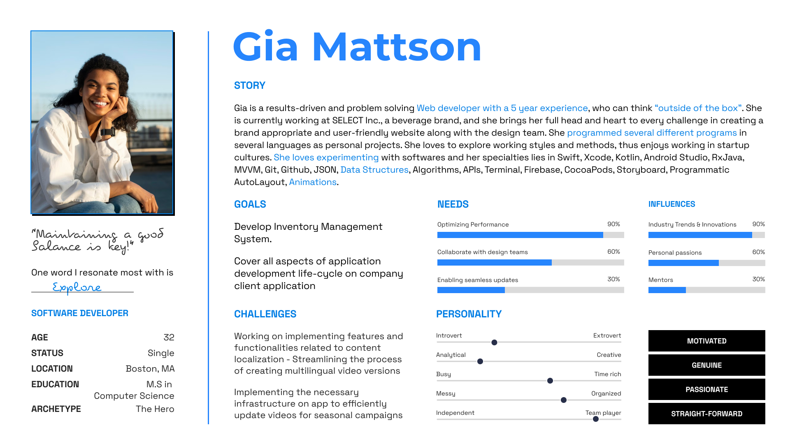

# Final Project: Part III

It all started when one of my teammates last semester said he wouldn’t be able to look at one of the reference sites I shared with my him because the motion graphics on the site gave him a headache. At first, I neglected it thinking he was making an excuse but later did some quick research to realize that it was an actual issue faced by many. 

So, through sharing the story “Web through all Lenses”, I want to educate website designers and developers who use all the latest tools and claim to follow accessibility guidelines but still end up with sites that aren't fully usable for all. It’s not that they are doing anything entirely wrong, but I want to highlight that there is still work to be done on this issue and bring to light the user group that gets overlooked.

**View Full Story here -> [Shorthand](https://carnegiemellon.shorthandstories.com/web-through-all-lenses-mish-patel/index.html)** 

My goal for this project was with the help of data and its visualizations to spread awareness, so it was important that my story speaks to professionals who engage in website design processes as part of their daily lives thus for the purpose of this project, I undertook perspectives and feedback from three different individuals from within the web design world to refine and better deliver the story. By learning from professionals, themselves, I gained crucial insights into remaining gaps.

The study is intended to cater to an audience/reader persona that can be described as follows:

The design choices I made for the story were heavily influenced by the target audience in the following ways:

- It allowed me to divide up the narrative into larger two sections: One that talks about the 3 types of disabilities and the next that talks about how the web experience is not fully accessible. I focused on silently transitioning from one section to another as I realized that the audience might easily skip either of the two sections if the content was evidently separated. 

- It allowed me to decide upon the types of charts to be shown to make sure they are easy to read and digest. Some data needed to be shown more graphically while some needed to be shown via traditional bar chart and my interviews during Part I and II of this project helped me determine which to use at what point.

- It also made me realize that some information had to be translated as an experience to create an impact. That led to the idea of literally projecting a situational disability and showcasing the reader the possibility of seeing more yellow on a webpage as they age. 

## Progress made after Part II

I focused on refining the visual elements, ensuring consistency in color palettes across charts, enhancing contrast for better readability, and making design tweaks such as implementing hover-over data, placing labels directly on graphs, adjusting animation speed, and reorganizing layouts for easier understanding of key data points and relationships. I also edited images to align with the main messages and ensured proper sourcing. In parts where more explanation was needed, I added textual content. Initially, I posed a question at the end of the story to encourage readers to contemplate innovative ways to improve website design. However, I extended a little and included a call-to-action section, providing valuable resources for readers to delve deeper into the topic and guide their design processes.

## Major learnings throughout the process in different segments -  

### DATA COLLECTION

In the development of “Web through all lenses”, I learned how to balance collecting and articulating the needed data to weave the story to be told. Sometimes you must start with a little data and as you further in the story you realize that additional data will be needed, and you collect it and keep building your narrative. 

### KNOWING THE AUDIENCE

As I discussed above, interacting with potential audiences helped a lot in making some micro as well as macro designs regarding the data visualizations and the narrative design of the story. It becomes very crucial what you ask during interviews because people love to talk, and they can easily go off-track sometimes. Preparing a question list before the interview helps. Also filtering out the information is equally important. I learned to critically select and apply the feedback I received. 

[Back to Final Project](final_project_MishPatel.md) 
[Back to Portfolio](README.md)
